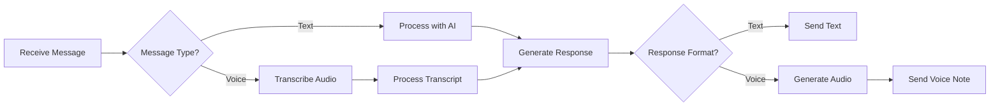

# 🤖 WhatsApp AI Agent

**Voice-enabled WhatsApp AI assistant powered by Evolution API and OpenAI**

Transform your WhatsApp into an intelligent AI assistant that processes both text and voice messages. Connect through QR code scanning and let your AI agent handle conversations naturally with voice capabilities.


## ✨ Features

### 🎤 Voice Message Processing
- **Automatic Transcription** - Converts voice messages to text using Whisper API
- **Voice Responses** - Generate voice replies using OpenAI TTS
- **Multi-language Support** - Process messages in any language
- **Audio Format Handling** - Supports OGG, MP3, WAV formats

### 📱 WhatsApp Integration
- **QR Code Connection** - Scan to connect your WhatsApp instantly
- **Multi-session Support** - Manage multiple WhatsApp accounts
- **Real-time Messaging** - Instant message processing and responses
- **Group Chat Support** - Works in both individual and group chats

### 🤖 AI Capabilities
- **Contextual Conversations** - Maintains conversation history
- **Custom Personalities** - Configure AI agent behavior and tone
- **Smart Routing** - Different responses for different contact types
- **Function Calling** - Execute actions based on message content

### 📊 Dashboard & Monitoring
- **Web Dashboard** - Real-time monitoring of conversations
- **Message Analytics** - Track usage and response patterns
- **Session Management** - Control active WhatsApp connections
- **Export Conversations** - Download chat histories

## 🚀 Getting Started

### Prerequisites
- Node.js 18+ installed
- Evolution API instance running (or use cloud)
- OpenAI API key for AI features
- WhatsApp account for connection

### Installation

1. Clone the repository
```bash
git clone https://github.com/obedvargasvillarreal/whatsapp-ai-agent.git
cd whatsapp-ai-agent
```

2. Install dependencies
```bash
npm install
```

3. Set up environment variables
```bash
cp .env.example .env
```

4. Configure your `.env` file
```env
# Evolution API Configuration
EVOLUTION_API_URL=http://localhost:8080
EVOLUTION_API_KEY=your-evolution-api-key
EVOLUTION_INSTANCE_NAME=ai-agent

# OpenAI Configuration
OPENAI_API_KEY=your-openai-api-key
OPENAI_MODEL=gpt-4o-mini
WHISPER_MODEL=whisper-1
TTS_MODEL=tts-1
TTS_VOICE=nova

# Agent Configuration
AGENT_NAME=AI Assistant
AGENT_PERSONALITY=helpful, friendly, professional
AGENT_LANGUAGE=en

# Server Configuration
PORT=3003
DASHBOARD_PORT=3004
```

5. Start Evolution API (if running locally)
```bash
docker run -d \
  --name evolution-api \
  -p 8080:8080 \
  evolutionapi/evolution-api:latest
```

6. Run the setup script
```bash
npm run setup
```

7. Start the agent
```bash
npm start
```

8. Scan the QR code displayed in terminal to connect WhatsApp

## 🎯 How It Works

### Connection Flow
1. **Initialize** - Agent connects to Evolution API
2. **Create Instance** - Sets up WhatsApp session
3. **Generate QR** - Displays QR code for scanning
4. **Connect** - Scan with WhatsApp mobile app
5. **Listen** - Agent starts processing messages

### Message Processing


### Voice Processing Pipeline
1. **Receive Audio** - Get voice message from WhatsApp
2. **Download** - Fetch audio file from Evolution API
3. **Convert** - Transform to compatible format (if needed)
4. **Transcribe** - Use Whisper API for speech-to-text
5. **Process** - AI analyzes transcribed text
6. **Generate** - Create text response
7. **Synthesize** - Convert to voice using TTS
8. **Send** - Deliver voice note back to WhatsApp

## 📝 Usage Examples

### Basic Text Conversation
```javascript
// User sends text message
"What's the weather like today?"

// Agent responds with text
"I'd be happy to help with weather information! However,
I don't have real-time weather data access. You can check
weather.com or your local weather app for current conditions."
```

### Voice Message Handling
```javascript
// User sends voice message
[Voice: "Can you help me schedule a meeting for tomorrow?"]

// Agent transcribes and responds with voice
[Voice: "I can help you think about scheduling your meeting.
What time works best for you tomorrow? Consider checking your
calendar for availability."]
```

### Custom Commands
```javascript
// Configure custom commands in config/commands.js
{
  "/help": "Shows available commands",
  "/voice": "Toggle voice responses",
  "/personality": "Change agent personality",
  "/export": "Export conversation history"
}
```

## 🎨 Configuration

### Agent Personalities
Configure different personalities in `config/personalities.json`:
```json
{
  "assistant": {
    "name": "Professional Assistant",
    "prompt": "You are a helpful professional assistant...",
    "voice": "nova",
    "language": "en"
  },
  "friendly": {
    "name": "Friendly Buddy",
    "prompt": "You are a casual, friendly chat companion...",
    "voice": "onyx",
    "language": "en"
  },
  "technical": {
    "name": "Tech Support",
    "prompt": "You are a technical support specialist...",
    "voice": "echo",
    "language": "en"
  }
}
```

### Response Filters
Set up keyword filters in `config/filters.json`:
```json
{
  "blocked_keywords": ["spam", "inappropriate"],
  "auto_responses": {
    "hello": "Hello! How can I help you today?",
    "bye": "Goodbye! Have a great day!"
  }
}
```

## 🛠️ API Integration

### Evolution API Endpoints Used
- `POST /instance/create` - Create WhatsApp instance
- `GET /instance/qrcode` - Get QR code for connection
- `POST /message/send` - Send text/media messages
- `GET /message/list` - Retrieve message history
- `POST /webhook/set` - Configure webhooks

### OpenAI Integration
- **Whisper API** - Audio transcription
- **ChatGPT API** - Message processing
- **TTS API** - Voice synthesis

## 📊 Dashboard Features

Access the web dashboard at `http://localhost:3004`

- **Real-time Stats** - Active sessions, messages processed
- **Conversation View** - Monitor ongoing chats
- **Session Control** - Start/stop/restart connections
- **Export Data** - Download conversation logs
- **Configuration** - Update settings without restart

## 🔧 Advanced Features

### Multi-Instance Support
```javascript
// Connect multiple WhatsApp accounts
const instances = [
  { name: 'sales', personality: 'sales_agent' },
  { name: 'support', personality: 'tech_support' },
  { name: 'personal', personality: 'assistant' }
]
```

### Custom Function Calling
```javascript
// Register custom functions for AI to use
agent.registerFunction('checkCalendar', async (date) => {
  // Your calendar integration logic
  return availableSlots;
});
```

### Webhook Integration
```javascript
// Forward messages to external systems
agent.on('message', async (msg) => {
  await webhook.send('https://your-api.com/webhook', msg);
});
```

## 🚧 Roadmap

- [ ] Advanced voice cloning for personalized responses
- [ ] Integration with calendar and task management
- [ ] Support for document processing (PDF, images)
- [ ] Multi-modal responses (voice + images)
- [ ] Conversation analytics dashboard
- [ ] Template message support
- [ ] Scheduled message sending
- [ ] Integration with CRM systems

## 🤝 Contributing

Contributions are welcome! Feel free to:

1. Fork the repository
2. Create your feature branch (`git checkout -b feature/AmazingFeature`)
3. Commit your changes (`git commit -m 'Add some AmazingFeature'`)
4. Push to the branch (`git push origin feature/AmazingFeature`)
5. Open a Pull Request

## 📄 License

This project is open source and available under the [MIT License](LICENSE).

## 🙏 Acknowledgments

- Evolution API team for WhatsApp integration
- OpenAI for AI capabilities
- The Node.js community for excellent libraries

## 📧 Contact

**Obed Vargas Villarreal**
- Portfolio: [obeskay.com](https://obeskay.com)
- LinkedIn: [linkedin.com/in/obeskay](https://www.linkedin.com/in/obeskay/)
- Email: [hola@obeskay.com](mailto:hola@obeskay.com)

---

*Built with ❤️ to bring AI intelligence to WhatsApp conversations*
*Making AI assistants accessible through the world's most popular messaging app* 📱